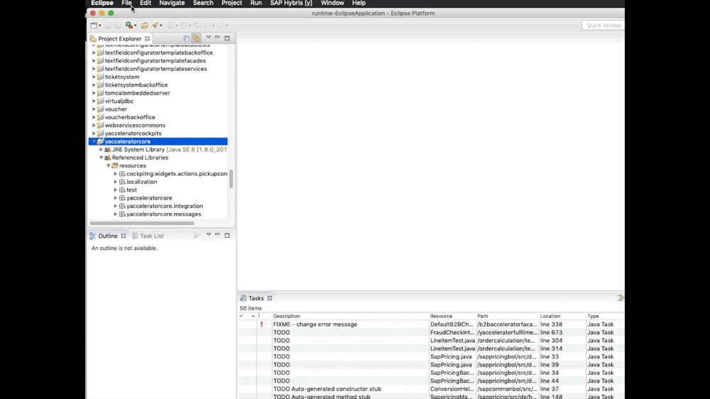
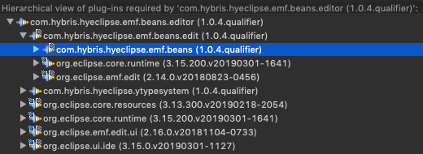

# Beans Generation Wizard

In SAP Commerce, it is possible to generate your custom Java Beans or Enums. In your extension, you can provide a configuration file in which you specify the class name, attributes, and a possible superclass of your Java Bean or Enum.

Definitions of these Java Beans or Enums are merged across extensions. For example, if two extensions specify a bean and enum with the same, fully classified class, the generated class includes the attributes from these two extensions. This way, you can extend already existing beans and enums, and do not have to subclass them, or replace references to the former bean and enum.

## Feature architecture

Feature consists of 3 separate plugins, which mainly are caused by EMF generated structure:

* com.hybris.hyeclipse.emf.beans.editor
* com.hybris.hyeclipse.emf.beans.edit
* com.hybris.hyeclipse.emf.beans

Dependency between them presents image below

## References

[SAP Help | Generating Beans and Enums](https://help.sap.com/viewer/d0224eca81e249cb821f2cdf45a82ace/1905/en-US/8bc53579866910149472ccbef0222ec5.html)

## Changelog

### 1.4

Feature introduction. Possibility to add new file from File -> New.. -> Other (&#8984; N or <kdb>CTRL</kbd> N)

#### Compatibility

| Eclipse | SAP Commerce |
| ------- | ------------ |
| (2018-12, 2019-*) | 6.6+, 1808+, 1905+ |