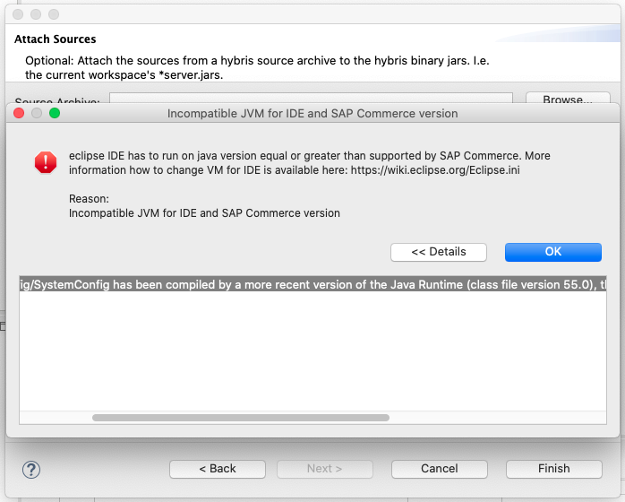

# Knowledge Database

Document collects known issues related to plugin and solutions for them.

## JVM 11/17 Compatibility

Eclipse IDE should be run on the same or newer JVM version like SAP Commerce. That is caused due to dynamic JAR binding to IDE class loader to be able to run Commerce core functionality for project import and project build. Having older JVM will cause error shown below:

Details how to set up JVM for Eclipse IDE can be found on page https://wiki.eclipse.org/Eclipse.ini

Information about SAP Commerce JVM compatibility is available on SAP Help page "Third-Party Compatibility"

Milestone JVM changes for SAP Commerce:

| SAP Commerce Version | Java Version |
| -------------------- | -------------|
| <= 5.5.0             | Java 7 (1.7) |
| 5.5.1 - 6.7          | Java 8 (1.8) |
| 1808 - 1811          | Java 8 (1.8) |
| 1905 - 2207          | Java 11      |
| 2211                 | Java 17      |

